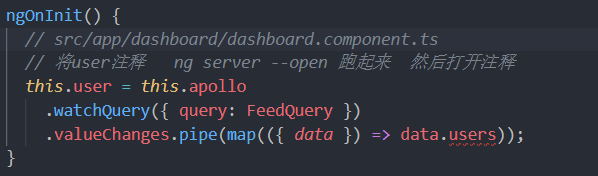
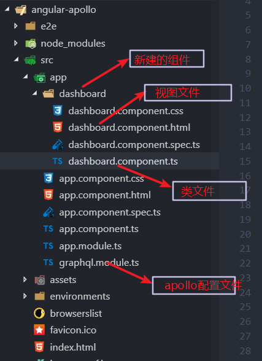
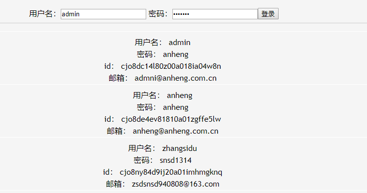

# AngularApollo

This project was generated with [Angular CLI](https://github.com/angular/angular-cli) version 7.0.5.

## Document

Angular : https://www.angular.cn/guide/quickstart

Apollographql:https://www.apollographql.com/docs/

### How  to  run?

1.下载包

```
$ npm install
```

2.启动项目

````
$ ng serve or ng serve --open
````

注意：启动项目前先将此段代码注释，启动后再将注释打开



### List



 

## watch

